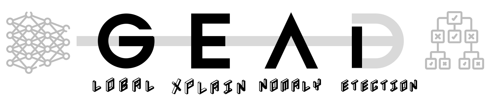
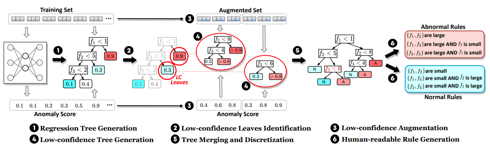

<div align=center></div>

> *Rules Refine the Riddle: Global Explanation for Deep Learning-Based Anomaly Detection in Security Applications.* Accepted by [CCS'24](https://www.sigsac.org/ccs/CCS2024).


## Introduction
This artifact is the implementation and experiment results of GEAD proposed in CCS'24.
In short, GEAD is a method for extracting rules in deep learning-based anomaly detection models. As shown in the figure below, it contains several core steps:

- **Root regression tree generation**: leveraging black-box knowledge distillation methods to extract a raw rule tree
- **Low-confidence Region Identification**: Find regions that cause inconsistencies between the original model and the tree-based explainable model
- **Low-confidence augmentation**: augmenting data that can lead to inconsistent decisions between the two models
- **Low-confidence rule generation**: using augmented data to expand original rules
- **Tree merging and discretization**: simplifying the rules to increase the readability for operators
- **Rule generation (optional)**: Convert the rule tree into readable a rule set


## Code Structure
The following is a brief introduction to the directory structure of this artifact:
```
- baseline/         ; code of baselines
- code/
    - gead.py       ; code of GEAD
    - gead_seq/py   ; code of GEAD (for RNN)
    - ...
- demo/ 
    - demo.ipynb    ; demo to show how to use GEAD
    - ...
- experiment/
    - results/  ;reproduced experient results
    - Fidelity_Evaluation.ipynb ; experiment 1
    - Usage 2.ipynb             ; experiment 2
- setup/        ;environment setup files   
- doc/              ; images used in README
- README.md         ; instructions of this artifact
```


## Environment Setup
> This implementation has been successfully tested in **Ubuntu 16.04** server with **Python 3.7**.
To ensure compatibility, this artifact (pytorch-based parts) can be fully run with **CPU** (GPU/CUDA is not required).

First, the experiments or demos in this artifact mainly use [jupyter notebook](https://jupyter.org/). So make sure you can view and execute the notebook (.ipynb) files. 
The following command can be easily used for installing the environment of jupyter notebook:
```
pip install notebook
```
How to use jupyter notebook can be found on the [official website](https://docs.jupyter.org/en/latest/). In short, select the right kernel (running environment) and then execute all cells (except markdown cells) in sequence. All cells in this artifact have been pre-executed with output shown. If all goes well, you should get consistent output in your environment.

To ensure the proper functioning of this artifact, we outline two methods for setting up the required environment:


### Method 1: Using `requirements.txt`
The `requirements.txt` file contains a list of Python packages and their respective versions that are necessary for the artifact to run. To build the environment using this file, follow these steps (we highly recommand use python 3.7 as we do ):
1. Ensure that you have Python and `pip`, the Python package installer, installed on your system.
2. Open a terminal or command prompt.
3. Navigate to the directory containing the `requirements.txt` file.
4. Run the following command to install all the required packages:
   ```bash
   pip install -r setup/requirements.txt
   ```
   This command tells `pip` to install all the packages listed in the `requirements.txt` file.

### Method 2: Using `conda.yml`
For users who prefer to manage their Python environments with `conda`, or need to work with packages that are not available through `pip`, we provide a `conda.yml` file. This file contains a list of conda packages and their versions needed for the artifact. To build the environment using `conda`, follow these steps:
1. Ensure that you have `conda` installed on your system. If you do not have `conda`, you can install it as part of the Anaconda distribution or Miniconda.
2. Open a terminal or command prompt.
3. Create a new conda environment with the name of your choice (e.g., `GEAD`) and specify the `conda.yml` file to configure it:
   ```bash
   conda env create -f setup/conda.yml --name GEAD
   ```
4. Once the environment is created, activate it by running:
   ```bash
   conda activate GEAD
   ```
   This will switch your command line environment to use the newly created conda environment with all the necessary packages.


## Demo
We provide **[a step-by-step demo](demo/demo.ipynb)** of explaining an autoencoder-based anomaly detection model with GEAD, which is also the result in Section 4.3.1 of our paper.

## Experiment Results

The output of the experiments will validate the following claims:
- (Quality of GEAD) **Figure 3 on page 7** is reproduced in **[experiment/Fidelity_Evaluation.ipynb](experiment/Fidelity_Evaluation.ipynb)** and the results are shown in:
    - `experiment/results/figure3_part1(Positive Consistency).png`
    - `experiment/results/figure3_part2(Negative Credibility).png`
- (Quality of GEAD) **Table 1 on page 7** is reproduced in **[experiment/Fidelity_Evaluation.ipynb](experiment/Fidelity_Evaluation.ipynb)** and the results are shown in:
    - `experiment/results/Table1_part1(CICIDS2017).csv`
    - `experiment/results/Table1_part2(Kitsune).csv`
    - `experiment/results/Table1_part3(Kyoto2006)`
    - `experiment/results/Table1_part4(HDFS).csv`
- (Usage of GEAD) **The statement of the inverse relationship between AUC and the number of rules** (see Insight 5 on page 11 and section 4.3.2) is verified in **[experiment/Usage_2.ipynb](experiment/Usage_2.ipynb)** and the reproduced cases of Figure 6 on page 9 are shown in:
    - `experiment/results/figure6_case2_part1(loss-auc).png`
    - `experiment/results/figure6_case2_part2(rule-auc).png`


Our artifact does not validate the following claims/experiments:
- Usage 3 in section 4.3.3 (also Section 5). These experiments were conducted with State Grid Corporation of China. Due to data compliance and privacy restrictions, we cannot leak any of data, even in a private or certified manner.

- Other insights and experiments that require case-by-case analysis with various background knowledge (such as Usage 1 in Section 4.3.1). This part of the experiment does not have clear verifiable indicators but requires analysis based on specific circumstances (the analysis process has been introduced in the paper). At the same time, these contents are not our claims against GEAD, but are based on GEAD’s analysis of existing systems, so we leave it out of scope of artifact evaluation. 

## Important Notes for AEC Review

**To facilitate AEC review, we summarize the materials and instructions related to the three badges as follows:**

### 1. Artifacts Available
This artifacts will be put into Zenodo and public in Github. 

### 2. Artifacts Evaluated
We have include a demo to show how to use GEAD at **[here](demo/demo.ipynb)**, which could help you to understand how to use and the workflow of GEAD.
In order to facilitate understanding of the GEAD code and verify its integrity, we briefly explain the relevant code in `code/gead.py` (the same applies to `gead_seq.py`) according to the GEAD process as introduced in "**Introduction**": 
- **Root regression tree generation**: see `get_roottree()` function on line 112 of `code/gead.py`
- **Low-confidence Region Identification**: also in `get_roottree()` function on line 112 of `code/gead.py`
- **Low-confidence augmentation**: see `lc_data_augment()` function on line 140 of `code/gead.py`
- **Low-confidence rule generation**: see `get_lc_trees()` function on line 386 of `code/gead.py`
- **Tree merging and discretization**: see `get_merged_tree()` function on line 717 of `code/gead.py`
- **Rule generation (optional)**: we leave this to specific applications since this step is optional (as stated in our paper)

### 3. Results Reproduced
Please see the above section in this README ("**Experiment Results**") and specific notes in the jupyter notebook files.