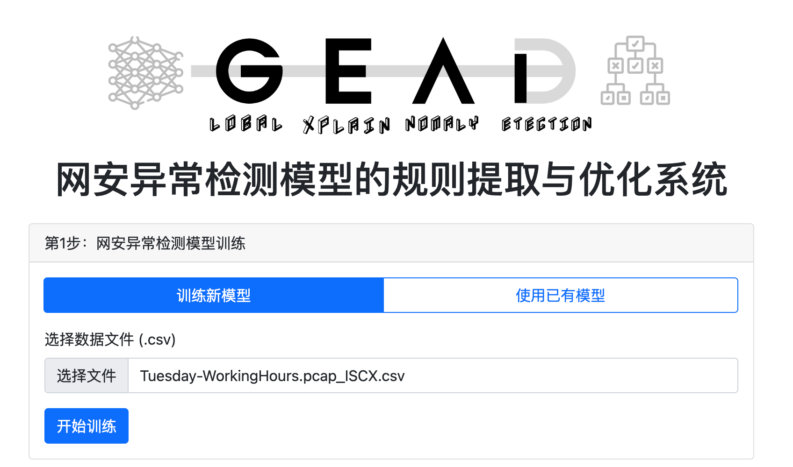
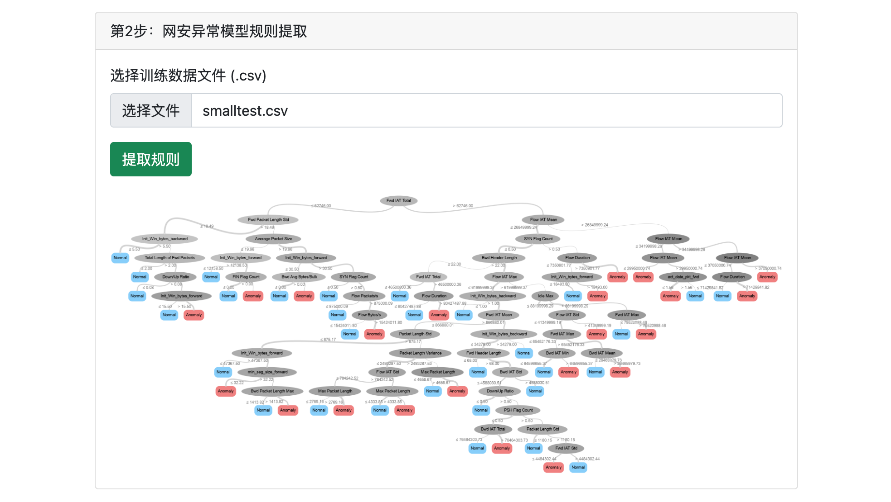
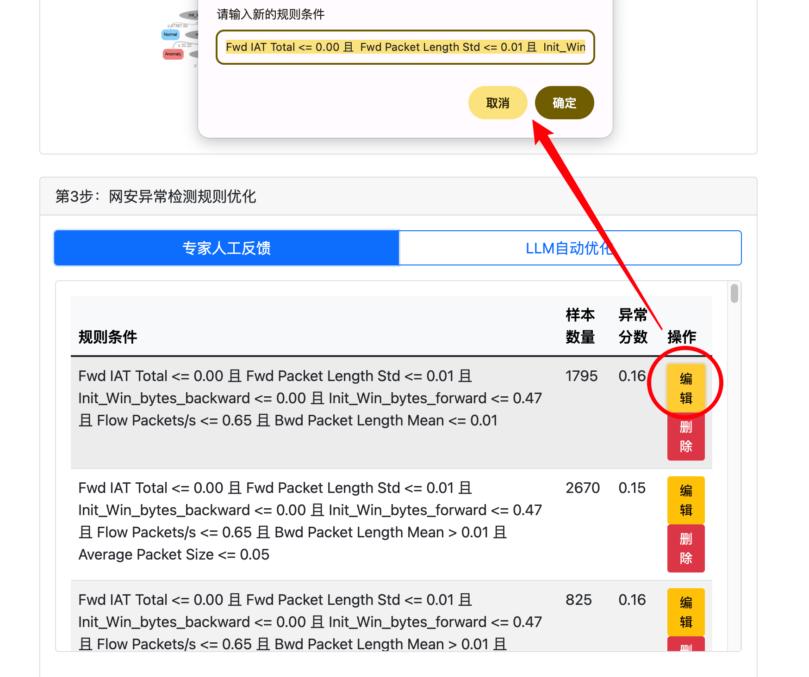
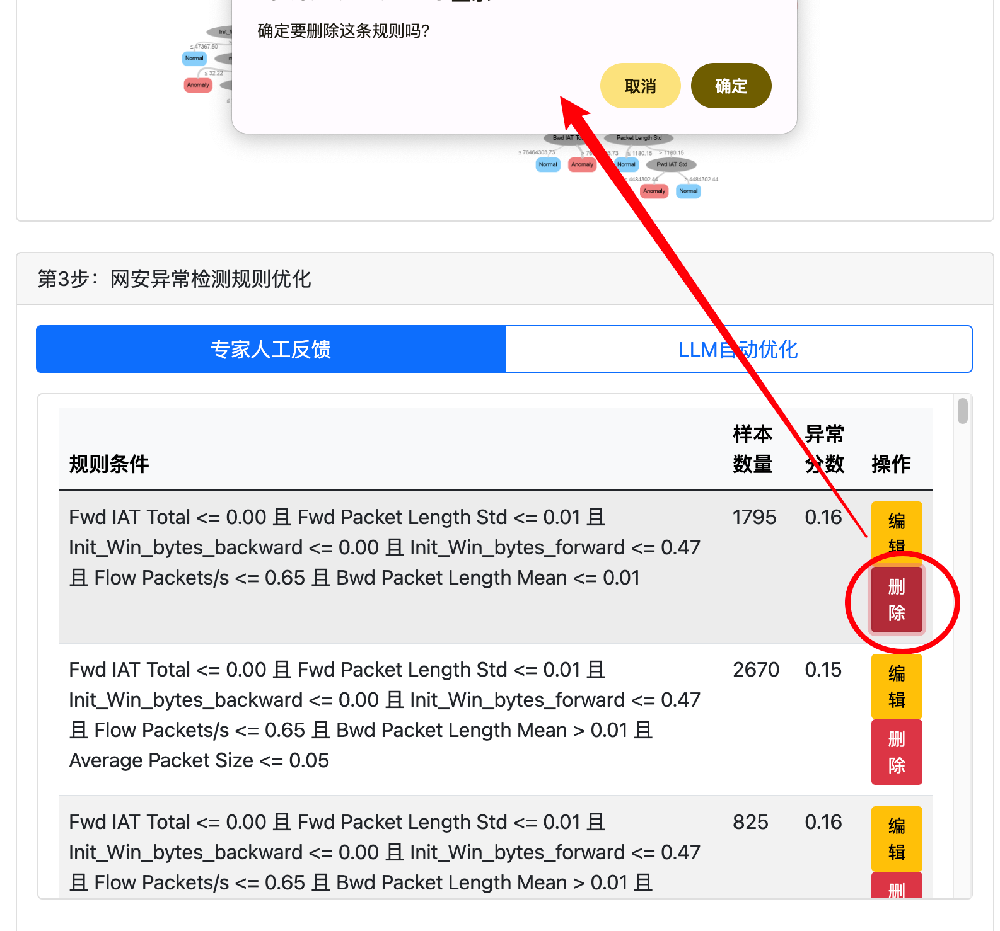
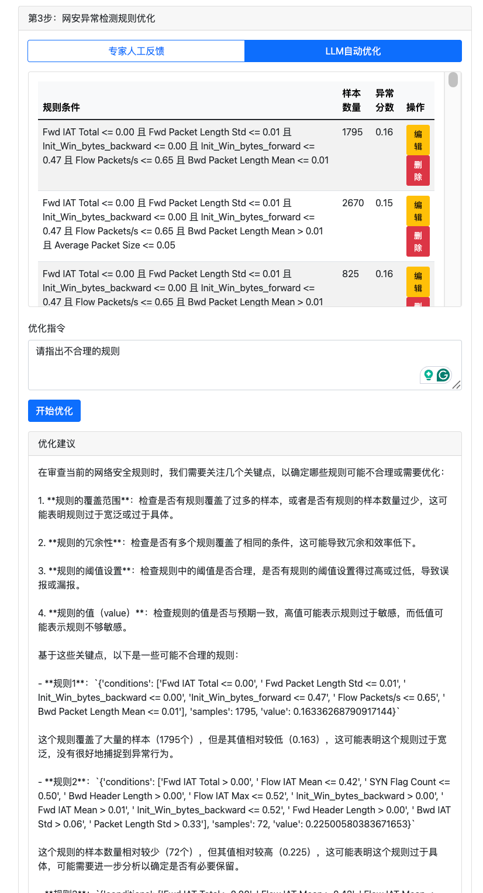

<div align=center></div>


> 本项目相关的论文成果已被 [ACM CCS'24](https://www.sigsac.org/ccs/CCS2024) 接收并获得[Distinguished Artifact Award](https://www.sigsac.org/ccs/CCS2024/program/awards.html)。

[English (CCS'24)](./README.md)

# 开源网安计划 — GEAD
## 项目简介

GEAD项目旨在提高网络安全异常检测系统在实战场景中的可靠性和可解释性，能准确提取出复杂深度学习模型的完整检测逻辑，实现网络安全异常事件的自动检测、规则提取与优化。项目核心在于将深度学习模型的预测结果转化为可解释的决策规则，并通过反馈机制不断优化检测性能。

## 核心功能

### 功能1：网络安全异常检测模型自动训练

该功能基于深度自编码器(Autoencoder)等模型实现网络安全异常检测模型的自动训练。系统能够自动处理网络流量数据，进行特征提取和模型训练，并最终生成可用于实时检测的深度学习模型。训练过程中支持自定义异常检测阈值，并自动优化模型参数。

### 功能2：网络安全异常检测模型规则提取

该功能通过决策树算法将深度学习模型的预测结果转化为可解释的规则。系统能够自动分析模型在低置信度区域的决策边界，提取出具体的特征阈值规则。支持对提取的规则进行可视化展示，便于安全分析人员理解和验证。

### 功能3：网络安全异常检测规则反馈优化

该功能实现了检测规则的双重优化机制。首先支持人工反馈，安全分析人员可以手动标记规则中的误报和漏报情况，系统会根据反馈自动调整规则阈值和决策边界。其次集成了LLM智能分析，通过大语言模型自动分析规则库，识别潜在的错误模式、逻辑漏洞和优化空间，并生成优化建议。系统会根据优化建议自动生成新的测试样本，验证规则优化效果，确保规则库的准确性和适应性不断提升。

## 安装
本项目支持两种模型下运行，分别是**命令行模式**和**Web UI界面模式**：

### 1.命令行模式运行

```bash
git clone
# 创建conda环境（Python 3.7.16）
conda create -n GEAD python=3.7.16
conda activate GEAD

# 安装依赖包
pip install -r GEAD/setup/requirements.txt

#命令行模式下的demo示例
jupyter notebook demo/demo.ipynb
```

### 2.用户UI界面运行：
```bash
# 安装依赖包
pip install -r GEAD/web/requirements.txt

# 启动Flask服务器(指定端口，默认为5000)：
python web/app.py --port 5000

# 打开浏览器访问 http://localhost:5000
```
**如需要使用LLM api（大模型驱动的规则优化），需要配置`web/llm_config.yml`文件：**

- 支持多种LLM服务：Moonshot AI、OpenAI、Claude、文心一言等
- 选择需要使用的LLM服务，将对应服务的`enabled`设为`true`
- 配置对应服务的`api_key`和其他必要参数

## 主要功能截图


<div align=center></div>
<div align=center></div>
<div align=center></div>
<div align=center></div>
<div align=center></div>


## 贡献
欢迎贡献代码和想法。请在GitHub上提交问题或拉取请求。
## 许可证
本项目使用MIT许可证。